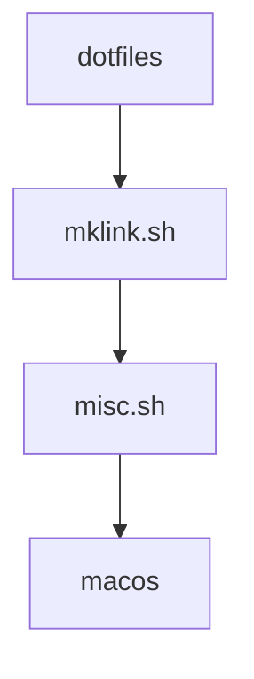

# John’s dotfiles

## Installation

```bash
git clone https://github.com/tuna-f1sh/dotfiles && cd dotfiles
./mklink.sh # Make symbolic links of dotfiles to home
./mklink.sh .config # Make symbolic links of .config folders to .config (or
other folder)
./misc.sh # Run other setup items
./macos # Configure MacOS if using
```

>! [NOTE]
> blah



Edit ~/.secrets to add machine only stuff and API keys.

# Notes

* `mkdir ~/.vim/.vimundo` for vim undo to work.
* [Powerline Fonts](https://github.com/powerline/fonts)
* `.zshenv` is sourced as every spawn. Should include non-interactive exports.
  Not in the links dir - see note on this in notes dropbox.
* `fzf` needs to generate .fzf.zsh by calling '/opt/homebrew/bin/fzf/install' or `fzf --zsh > ~/.fzf.zsh`.
* make a new ~/.prompt.zsh for new machine `p10k configure`.
* Edit '~/.secrets' with API keys but also:
    * `DOTFILES_VIM_FULL_FAT`: use all plugins.

## Useful Terminal Progs

* `fd` - easy to use `find`
* `ncdu` - visual `du`
* `bat` - nicer `cat`
* `up` - pipe tester
* `crex` - regex test [crex](https://octobanana.com/software/crex)
* `peaclock` - binary clock for CLI
  [peaclock](https://octobanana.com/software/peaclock)
* `=` - perform python calculations inline 'support/scripts/='
* [`flocki`](https://github.com/denisidoro/floki) - json drilldown

## macOS

* Homebrew I have dumped Brewfile: `brew bundle dump`. Provision new machine with `brew bundle install`.
* `trash` - in brew provides Trash control

Generally migrated macOS without migration assistant. Summary of places of importance:

* '~/Library/Application Support': Application data, scanned through and took what I thought would be useful.
* '~/Library/Preferences': Where most applications store there preferences (`XDG_CONFIG_HOME`), included macOS terminal etc. Did not copy all but when through cherry picking manually.
* '~/Library/Services': Custom Automator/AppleScripts I had in Finder actions.
* '~/Library/virtualenvs': Didn't copy (beauty of virtualenvs right?!) but might be useful.
* '~/Library/Fonts': Copied all these.
* Some Applications have folders in Library that are helpful to copy, 'arduino15' for example.

## Arch

* './pkglist.txt' and './pkglist_aur.txt' (AUR) refering to https://wiki.archlinux.org/title/migrate_installation_to_new_hardware: `pacman -S --needed - < pkglist.txt`
* `usermod -a -G uucp _reguser_` - add user to USB serial devices
* Add ./support/udev/rules.d as required.

## Windows

* [babun shell](http://babun.github.io/)
* [conemu terminal for quake style](https://conemu.github.io/)
* Make `$HOME` windows user profile directory
* `CYGWIN=winsymlinks:nativestrict` env variable before running link script
  but then remove for proper operation of ZSH.

### WSL

* link/wsl contains functions and defines, must export `WSL=true` in .secrets to source
